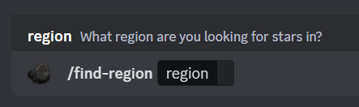

# Star-Caller

>Utilize the following commands, in order, in the terminal window to run this program. If running your own bot, initialize a file titled `.env` and declare your bots discord token there in the following format:

`token = place your token here`

`api = "place the str(url) to your api endpoint here"`

>After establishing your environment variables, find the [AUTHORIZED_SERVER_IDS](https://github.com/Savoie-J/Star-Caller/blob/4d5b0ee6c15e615f56e83645d54ee7db0fe22467/main.py#L19C1-L22C2) list in main.py and update it to reflect your security needs, some commands will not function unless the server in which it is invoked is in this list. 
>>These commands will be denoted by the [@check_authorized_server()](https://github.com/Savoie-J/Star-Caller/blob/4d5b0ee6c15e615f56e83645d54ee7db0fe22467/main.py#L141C1-L150C41) decorator from here on and in the program.

## Terminal Guide

`python -m venv venv`

>Enables the virtual environment. 

### if on Windows;

`.\venv\scripts\activate`

### if on macOS/Linux;

`source venv/bin/activate`

>Activates the generated virtual environment.

`pip install -r requirements.txt`

>Installs all dependencies specified in the requirements file.

`python main.py`

>Runs the python program.

`Ctrl + C`

>Terminates the python program.

`deactivate`

>Deactivates the virtual environment.

----

## App Command Guide

### Create

`/create`

>Invoking this command will result in the creation of the base star table for future use, assuming one does not exist prior.

**Restrictions**: @Administrator permissions on discord & @check_authorized_server() decorator.

*(These restrictions ensure that multiple users can add this bot to their own servers, utilize the various find commands while accessing the host's data pool, without having any external impact on said data pool.)*

---

### Lock & Unlock

`/lock` & `/unlock`

>Invoking these commands lock or unlock the star table, restricting users abilities to alter the table.

**Restrictions**: @Manage_Events permissions on discord & @check_authorized_server() decorator.

 

---

### Clear-all

`/clear-all`

>Invoking this command will purge the star table of all entries.

**Restrictions**: @Manage_Events permissions on discord & @check_authorized_server() decorator.

---

### Clear-old

`/clear-old`

>Invoking this command will purge the star table of any entries that have expired beyond their reported fall time.

**Restrictions**: @Manage_Events permissions on discord & @check_authorized_server() decorator.

*(This command acts based on the time the command is invoked, if any entries lower bound for the star-fall has passed, said entry will be purged.)*

---

### Clear-restricted

`/clear-restricted`

>Invoking this command will attempt to purge any entries that expired 30 minutes beyond their reported fall time.

**Restrictions**: @check_authorized_server() decorator.

*(This command can be triggered by anyone in the host server, as a result it has been limited to one invocation every 10 minutes to combat abuse. This command will also be triggered periodically in the background to reduce moderator action, as a result users will not be able input or alter data whilst this command is activated.)* 

---

### Call

`/call world: region: size: relative-time:`

>Invoking this command will prompt you for four required arguments, world[int], region[str], size[str], and time[int], upon succesful invocation it will respond with a public message announcing the star called, and update the star table with this information.
>>Users invoking this command will be quite limited to prevent abuse, all world integers are validated and only accepted if a server of that number exists, region and size arguments only allow for users to choose from the given options, and the time is an integer between 1:128 as star waves cannot be determined more than two hours ahead of time.
>>>This time argument is built on the assumption that users will provide the lower bound of the number (in minutes) that is given to them when viewing from a telescope, this ensures no user is late to a spawn due to the 2 minute variance, and helps to disincentivize users from submitting false calls provided by another source without verifying prior.
>>>>*For example; User A is informed by User B of a star falling at 20:04, it is currently 18:37 and User A wishes to submit this call via the command. In many cases it is simpler to just hop worlds and look at the telescope and be told the time in minutes, than to do the math to report User B's call prior to verifying. While not perfect, this system banks on laziness to ensure call integrity without impacting those contributing properly.*

**Restrictions**: @check_authorized_server() decorator.

*(Ensuring this system of public data submission responds well to abuse it is advised to quarantine this command to a single channel, any offenders submitting false data will have all their calls public and in a single place, unable to be altered or deleted. This is also why this commands invocation is limited to the host server.)*

 

---

### Prune

`/prune world:`

>Invoking this command will prompt you for a world[int], once given it will purge all data for that world.

**Restrictions**: @Manage_Events permissions on discord & @check_authorized_server() decorator.

---

### Find

`/find`

>Invoking this command will return a public response listing the largest stars found in the star table.

*(This command acts as a tl;dr of sorts, giving users a quick look over the star table for where they should look.)*

 

---

### Find-f2p

`/find-f2p`

>Invoking this command will return a public response listing the largest stars found on free-to-play worlds in the star table.

 

---

### Find-region

`/find-region region:`

>Invoking this command will prompt you for a region[str], upon invocation it will return an ephemeral list of all stars in the table corresponding to that region.

 

---

### Find-size

`/find-size size:`

>Invoking this command will prompt you for a size[str], upon invocation it will return an ephemeral list of all stars in the table of the corresponding size.

 

---

### Find-world

`/find-world world:`

>Invoking this command will prompt you for a world[int], upon invocation it will return an ephemeral list of the precise details for any star reported on that world, inlcuding any specific traits or details about the world itself.

 

---